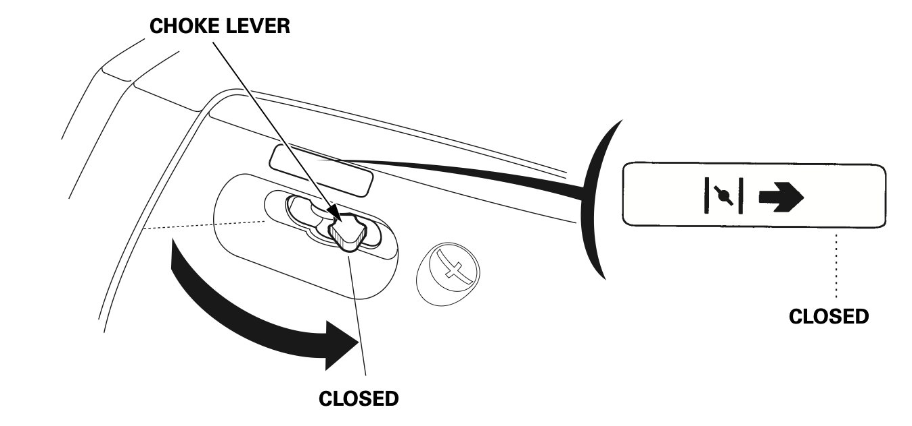
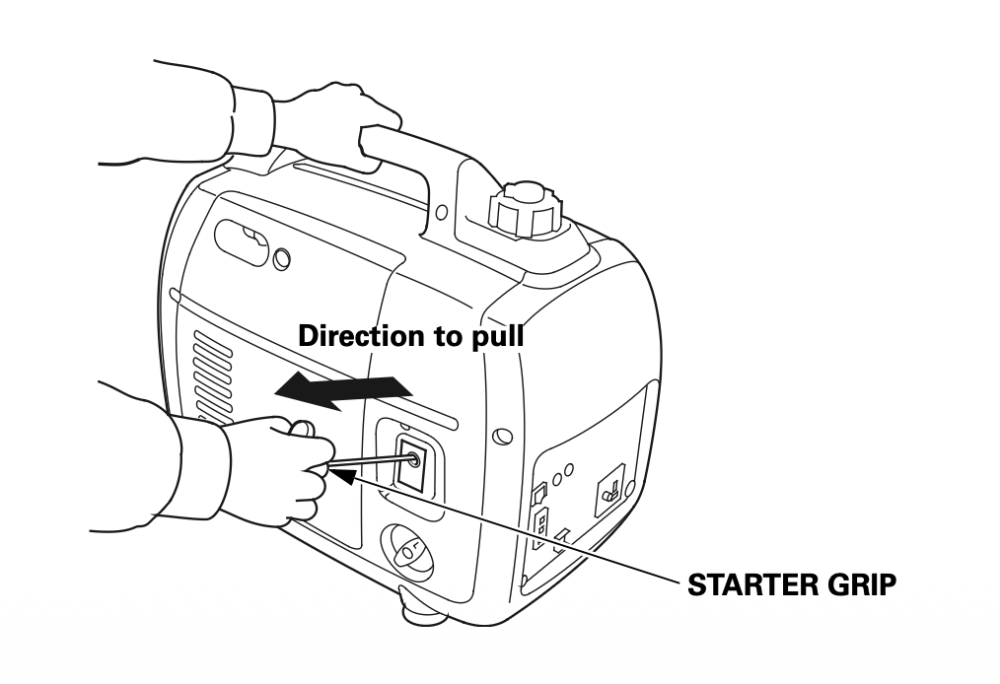
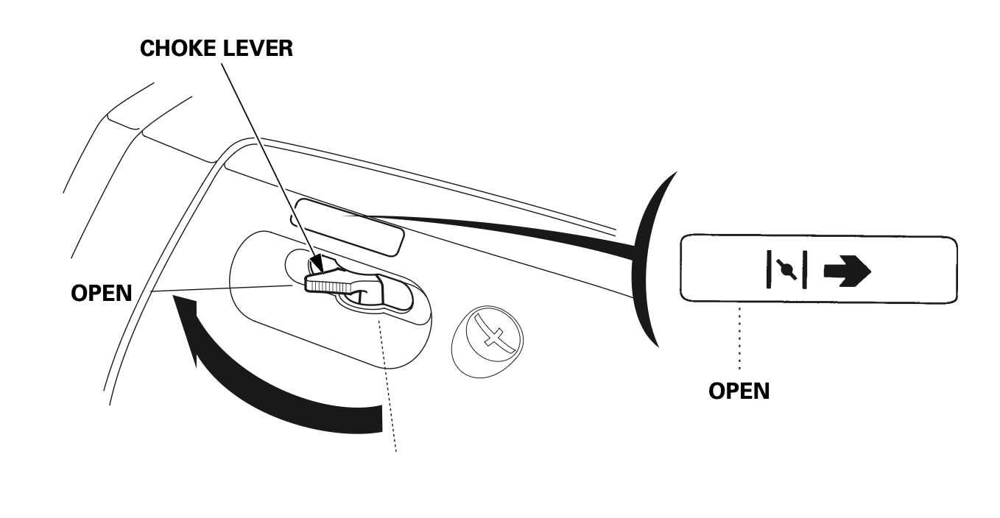

{.cover}

# Watt's The Problem?

## Start here {#start}

Generator given up the ghost? Ware-and-tear-wolves getting you down? Don't get spooked — most generator problems come down to four things, and you can check all of them with your hands, eyes, and a few simple tools.

Every engine needs four  things to run: **Fuel**, **Spark**, **Compression**, and **Air**. Petrol has to get from the tank, through the tap and lines, into the carburettor, and into the cylinder. The spark plug has to fire at the right moment to ignite it. The cylinder has to be sealed tight so the fuel-air mixture gets squeezed and explodes with force. And clean air has to mix with the fuel in the right ratio.

If any one of these is missing, the engine won't run. Our job is to figure out which one it is.

But first — before you touch a single bolt — do these quick checks. This is hard-won Greasemonkey wisdom, and skipping them has wasted more hours than we'd like to admit:

## Pre-flight checks

 - Are you correctly starting your generator? - [[#Starting a generator]]
 - **Fuel in the tank?** Is it the right kind — normal petrol, not 2-stroke mix or diesel?
 - **Oil level OK?** Most generators have a low-oil cutoff. If it won't start, this alone might be why.
 - **Fuel tap open?** Vertical is usually open, horizontal is closed — but just try both to be sure.
 - **Engine switch on?** Make sure the key or switch is in the "on" position.
 - **Any loose wires?** Especially the oil sensor and voltage sensor connectors. If they're disconnected, nothing will work.

## Okay but seriously, what's the problem?

All good? Now — what's your generator doing?

 - [[#Doesn't start at all]]
 - Starts but runs poorly
 - Engine runs but there's no electricity
 - It overheated and stopped

## Doesn't start at all

[[#Starting a generator]]

So you've gone through the steps — fuel on, choke closed, switch on, pull the cord or turn the key — and... nothing. Let's narrow it down.

What happens when you try to start it? Watch and listen carefully:

 - Nothing at all. No sound, no movement, completely dead. [[#Dead silent]]
 - It clicks or whirrs, but the engine doesn't turn over. The starter is trying but the engine isn't moving. [[#Clicks but won't crank]]
 - The engine turns over, but won't catch. You can hear it cranking - or feel it turning on the pull cord - but it never fires. [[#Cranks but won't catch]]
 - It fires briefly then dies. It catches for a moment - maybe a cough or a sputter - then stops. [[#Fires then dies]]

If you're on a pull-start generator and you're not sure whether the engine is "turning over," here's what to feel for: when you pull the cord, you should feel the resistance of the engine compressing. If the cord pulls freely with no resistance, something is mechanically wrong. If it feels normal but the engine never fires, that's "cranks but won't catch."

## Starting a generator

  1. Check oil and fuel. Make sure there's enough of both. Running without oil will destroy the engine.
  2. Position it safely. Outdoors, on a flat stable surface, well away from tents and enclosed spaces. Generator exhaust is deadly.
  3. Disconnect any appliances. Don't start it under load.
  4. Open the fuel tap. This lets fuel flow to the carburettor.
  5. Close the choke. A cold engine needs a richer fuel mixture to start. The choke restricts airflow to make that happen. 
  6. Turn the engine switch to "on."
  7. Start the engine.
    - Electric start: Press the start button or turn the key.
    - Pull start: Pull the cord gently until you feel resistance — stop — then pull firmly. Don't just yank it from slack, that can damage the starter. If it doesn't start, let it stop turning completely before pulling again. 
  8. Open the choke gradually. Once the engine catches and warms up, slide the choke towards "open." If it stumbles, close it a bit and give it more time. 
  9. Let it warm up. Give it a minute or two before plugging anything in.

## Dead silent

You try to start it and absolutely nothing happens. No click, no whirr, no sign of life.

If your generator has a pull start, try that first — even if you normally use the electric start. Give it a proper pull (remember: gently to the resistance point, then pull firmly).

Did it start on the pull cord?

 - Yes, it started! Your engine is fine. The problem is in the electric starting circuit - the battery, the starter motor, or the wiring between them. You can keep pull-starting for now. Sounds like it's [[#Good Enough For The Burn]]. If you really like fixing things, then you could always [[#Check the starting circuit]].
 - It cranks on the pull cord, but won't catch. The engine can turn, so it's not seized. The starting circuit isn't your problem - something else is stopping it from firing. [[#Cranks but won't catch]]
 - The pull cord has no resistance / the engine won't turn. The engine might be seized. [[#Engine won't turn]]
 - There's no pull start on this generator. Let's [[#Check the starting circuit]]

## Clicks but won't crank

## Cranks but won't catch

## Fires then dies

## Good Enough For The Burn

## Check the starting circuit

The electric start system is simple: battery → switch → solenoid → starter motor. We're going to check each link in that chain.

Do you have a multimeter? If so, check the battery voltage. If not, that's fine — we can still narrow it down.

 1. Look at the battery terminals. Are they corroded, loose, or disconnected? Clean them up and tighten them. Even a thin layer of white or green crust can stop enough current getting through.
 2. Check the ground strap — the wire from the battery negative to the engine block or frame. If it's loose or broken, nothing will work. You can test this with jumper lead as a temporary ground.
 3. Check the key switch or kill switch. Is it in the right position? Try wiggling it. If you have a multimeter, check for continuity through the switch.
 4. Look for inline fuses on the battery or ignition wiring. A blown fuse is a quick fix.
 5. Listen for a relay click when you turn the key or press the start button. If you hear nothing at all, the relay, ignition switch, or wiring to it may be at fault.

Still nothing?

If you're comfortable with it, try bridging the starter solenoid terminals with a heavy jumper wire or screwdriver. This bypasses the switch and control circuit and sends power directly to the starter.

 - The engine cranks! → The solenoid or control circuit is at fault, but the engine and starter motor are fine. You can keep starting it this way in a pinch, or seek Greasemonkey assistance for a proper fix. [[#Greasemonkey assistance]]
 - Still nothing → The starter motor itself may be dead, or the battery is too flat to turn it. Try a jump start from a car battery or another charged battery, and if that doesn't work, seek Greasemonkey assistance.

## Engine won't turn

## Greasemonkey assistance