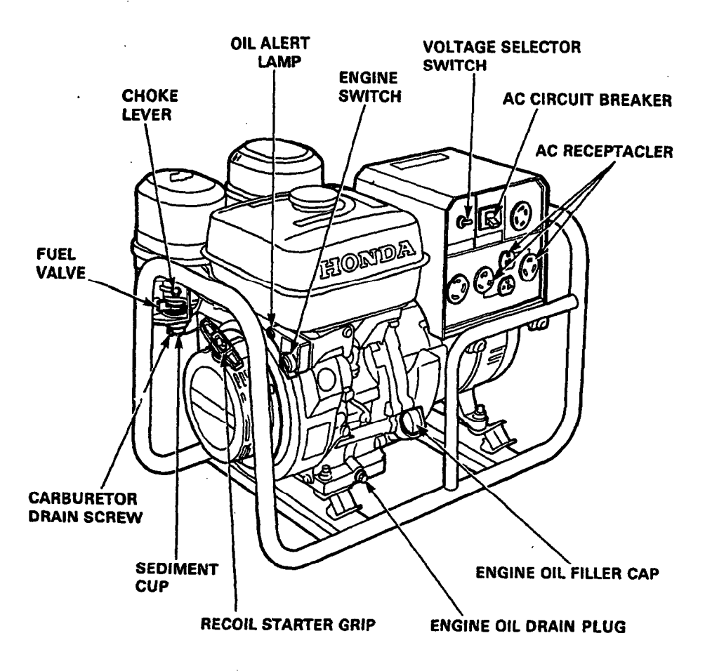

{.cover}

# Watt's The Problem?

## Start here {#start}

Generator given up the ghost? Ware-and-tear-wolves getting you down? Don't get spooked — most generator problems come down to four things, and you can check all of them with your hands, eyes, tentacles, and a few simple tools.

Every engine needs four  things to run: **Fuel**, **Spark**, **Compression**, and **Air**. Petrol has to get from the tank, through the tap and lines, into the carburettor, and into the cylinder. The spark plug has to fire at the right moment to ignite it. The cylinder has to be sealed tight so the fuel-air mixture gets squeezed and explodes with force. And clean air has to mix with the fuel in the right ratio.

If any one of these is missing, the engine won't run. Our job is to figure out which one it is.

But first — before you touch a single bolt — do these quick checks. This is hard-won Greasemonkey wisdom, and skipping them has wasted more hours than we'd like to admit:

## Pre-flight checks

 - Are you correctly starting your generator? - [[#Starting a generator]]
 - **Fuel in the tank?** Is it the right kind — normal petrol, not 2-stroke mix or diesel?
 - **Oil level OK?** Most generators have a low-oil cutoff. If it won't start, this alone might be why.
 - **Fuel tap open?** Vertical is usually open, horizontal is closed — but just try both to be sure.
 - **Engine switch on?** Make sure the key or switch is in the "on" position.
 - **Any loose wires?** Especially the oil sensor and voltage sensor connectors. If they're disconnected, nothing will work.

## Okay but seriously, what's the problem?

All good? Now - what's your generator doing?

 - [[#Doesn't start at all]]
 - Starts but runs poorly
 - Engine runs but there's no electricity
 - It overheated and stopped

## Doesn't start at all

[[#Starting a generator]]

So you've gone through the steps — fuel on, choke closed, switch on, pull the cord or turn the key — and... nothing. Let's narrow it down.

What happens when you try to start it? Watch and listen carefully:

 - Nothing at all. No sound, no movement, completely dead. [[#Dead silent]]
 - It clicks or whirrs, but the engine doesn't turn over. The starter is trying but the engine isn't moving. [[#Clicks but won't crank]]
 - The engine turns over, but won't catch. You can hear it cranking - or feel it turning on the pull cord - but it never fires. [[#Cranks but won't catch]]
 - It fires briefly then dies. It catches for a moment - maybe a cough or a sputter - then stops. [[#Fires then dies]]

If you're on a pull-start generator and you're not sure whether the engine is "turning over," here's what to feel for: when you pull the cord, you should feel the resistance of the engine compressing. If the cord pulls freely with no resistance, something is mechanically wrong. If it feels normal but the engine never fires, that's "cranks but won't catch."

## Starting a generator

  1. Check oil and fuel. Make sure there's enough of both. Running without oil will destroy the engine.
  2. Position it safely. Outdoors, on a flat stable surface, well away from tents and enclosed spaces. Generator exhaust is deadly.
  3. Disconnect any appliances. Don't start it under load.
  4. Open the fuel tap. This lets fuel flow to the carburettor.
  5. Close the choke. A cold engine needs a richer fuel mixture to start. The choke restricts airflow to make that happen. 
  6. Turn the engine switch to "on."
  7. Start the engine.
    - Electric start: Press the start button or turn the key.
    - Pull start: Pull the cord gently until you feel resistance — stop — then pull firmly. Don't just yank it from slack, that can damage the starter. If it doesn't start, let it stop turning completely before pulling again. 
  8. Open the choke gradually. Once the engine catches and warms up, slide the choke towards "open." If it stumbles, close it a bit and give it more time. 
  9. Let it warm up. Give it a minute or two before plugging anything in.

## Dead silent

You try to start it and absolutely nothing happens. No click, no whirr, no sign of life.

If your generator has a pull start, try that first — even if you normally use the electric start. Give it a proper pull (remember: gently to the resistance point, then pull firmly).

Did it start on the pull cord?

 - Yes, it started! Your engine is fine. The problem is in the electric starting circuit - the battery, the starter motor, or the wiring between them. You can keep pull-starting for now. Sounds like it's [[#Good Enough For The Burn]]. If you really like fixing things, then you could always [[#Check the starting circuit]].
 - It cranks on the pull cord, but won't catch. The engine can turn, so it's not seized. The starting circuit isn't your problem - something else is stopping it from firing. [[#Cranks but won't catch]]
 - The pull cord has no resistance / the engine won't turn. The engine might be seized. [[#Engine won't turn]]
 - There's no pull start on this generator. Let's [[#Check the starting circuit]]

## Clicks but won't crank

When you hit the start button or turn the key, you hear something — clicks, a whirr, or the starter trying to spin — but the engine itself isn't turning over.

The most common cause is a weak battery. The starter motor draws a lot of current, and if the battery can't deliver enough, you'll hear it struggling but the engine won't budge.

Try a jump start — connect a known good battery or jump from a vehicle battery. Does the engine crank now?

 - Yes, it cranks and starts! → Weak battery. Charge or replace it. → [[#Good Enough For The Burn]]
 - Yes, it cranks but won't catch → The engine can turn — that's good. Something else is stopping it from firing. → [[#Cranks but won't catch]]
 - Still just clicking → Probably not the battery. Keep reading.

  Listen to the click. When you press the start button, you should hear a solid "clunk" from the starter solenoid — *a small box, usually near the battery or on the*
  *starter motor, that acts as a heavy-duty switch connecting the battery to the starter motor*.

 - No click at all → The solenoid isn't getting the signal to close. Check the wiring from the start button to the solenoid, and check for blown fuses on that circuit. → Check the Starting Circuit
 - Single loud click but nothing else → The solenoid is working, but the starter motor isn't spinning. *The starter motor is a small cylindrical motor — about the size of a drink can — bolted to the side of the engine block, usually near the bottom, with thick wires running to it*. Give it a firm tap with a wrench while someone presses the start button — sometimes the internal brushes get stuck and a knock frees them. If that doesn't work, → [[#Greasemonkey assistance]]
  - Rapid clicking (like a machine gun) → Classic sign of a battery that's almost dead — it has enough power to close the solenoid, but the moment the starter tries to draw current, the voltage drops and the solenoid releases, over and over. Try a jump start again, making sure the connections are clean and tight.

  If you've got it cranking but it won't start, head to → [[#Cranks but won't catch]].

  If you can't get it to crank at all, let's check if the engine itself can turn. Remove the spark plug *(the porcelain-topped thing screwed into the top of the engine — you'll need a spark plug wrench or a deep socket)*. Now try pulling the pull cord, or turn the flywheel by hand — *that's the heavy metal disc behind the plastic cover on the side of the engine, where the pull cord is*.

 - The engine turns freely → The engine isn't stuck. The starter motor or its wiring is the problem. → [[#Greasemonkey assistance]]
 - The engine won't turn at all → Something is jammed inside. → [[#Engine won't turn]]

## Cranks but won't catch

The engine is turning over — you can hear it churning on the electric start, or feel it compressing and releasing on the pull cord — but it never fires. It's just spinning without catching.

This is actually good news. Your engine can move, which rules out a lot of mechanical problems. Something is missing from the recipe: either there's no spark to ignite the fuel, or no fuel is reaching the cylinder, or (less commonly) the cylinder isn't holding compression.

There's a quick test that can save you a lot of time. If you have a can of carburettor cleaner or starter fluid, spray a short burst into the air intake — *that's the opening where the air filter sits, leading into the carburettor*.

Now try to start it. Did it fire, even for a second?

- **Yes, it fired briefly on the spray!** → The spark and compression are probably fine. The problem is fuel delivery — fuel isn't making it from the tank into the cylinder. → [[#Check fuel]]
- **No, nothing at all** → Fuel might not be the issue. Let's check if there's a spark. → [[#Check Spark]]
- **I don't have carb cleaner** → No worries. Let's start with the spark check — it's quick and doesn't need any spray. → [[#Check spark]]

## Fires then dies

The engine catches — you hear it cough, sputter, maybe even run for a second or two — and then it dies. Every time. This is actually encouraging: it means spark and compression are probably working. The engine *wants* to run. Something is stopping it from staying lit.

Let's work through the most likely causes, quickest fixes first.

**Is the choke fully closed?** On a cold start, the engine needs a rich fuel mixture. If the choke is only partly closed — or if it's an auto-choke that isn't engaging — the mixture is too lean to sustain combustion. Close the choke fully, start the engine, and only open it gradually once it's warmed up and running steadily.

- That fixed it! → [[#Good Enough For The Burn]]
- Choke is fully closed, still dies → Keep reading.

**Check the oil level.** We keep coming back to this one because it catches people out every time. Most generators have a low-oil safety cutoff that shuts the engine down — it'll fire briefly and then the sensor kills it. Check the dipstick. If the oil is low, top it up and try again.

- That fixed it! → [[#Good Enough For The Burn]]
- Oil is fine, still dies → Keep reading.

**Try disconnecting the oil sensor.** The sensor itself can be faulty — it tells the engine there's no oil when there is. It's usually a single wire connector on the engine block, near the base. Pull it off and try starting.

- It runs now! → The sensor was giving a false reading. You can leave it disconnected for the burn, but keep checking your oil manually — you've just disabled your safety net. → [[#Good Enough For The Burn]]
- Still dies → Keep reading.

**Is fuel reaching the carburettor steadily?** The engine might be burning through whatever fuel is in the carburettor bowl, but not getting refilled fast enough. Disconnect the fuel line at the carb and check — does fuel flow freely and steadily when the tap is open? If it's a trickle or stops after a moment, the fuel supply is the problem. → [[#Check fuel]]

**Try the bypass bottle.** If you're not sure about the fuel supply, skip straight to the [[#Bypass fuel test]]. If the engine runs on the bypass bottle, the problem is somewhere in the tank, tap, line, or filter.

**Check for vapour lock.** Feel along the fuel line — is any part of it running close to the engine or exhaust where it gets hot? Heat can boil fuel in the line, creating a gas bubble that blocks flow. The engine starts on the fuel already in the bowl, but once that's gone, no more can get through. Reroute the line away from heat sources, let everything cool, and try again.

**Still fires and dies?** A few less common causes:

- **Governor linkage.** The governor is what keeps the engine running at a steady speed. Without it, the engine would speed up when you unplug an appliance and slow down when you plug one in. It works by connecting the engine's spinning internals to the carburettor's throttle through a set of springs and levers on the outside of the engine. When the engine speeds up, the governor pulls the throttle closed a bit; when it slows down, the governor opens it up. It's a constant balancing act. The problem is that these springs and levers are exposed, and generators vibrate a lot. Over time — sometimes just over the course of a burn — the linkage can "walk": vibration gradually loosens an adjustment screw, stretches a spring, or shifts a lever, until the governor is so far out of calibration that it can't keep the engine in its sweet spot. The engine starves for air or fuel and stalls. Check that all the linkage moves freely, springs are attached and haven't stretched, and nothing has worked itself loose. If an adjustment screw has vibrated out of position, you may be able to see that it's no longer seated where it should be. A Greasemonkey can help recalibrate it if needed.
- **Blocked exhaust.** A wasp nest, mud, or a crushed muffler can restrict exhaust flow enough to stall the engine. Check that air can flow out of the exhaust pipe.
- **Sheared flywheel key.** If the engine has had a hard knock, the small metal key that locks the flywheel to the crankshaft can shear, throwing the ignition timing off. The engine might fire but can't sustain. This one is hard to diagnose in the field. → [[#Greasemonkey assistance]]

If none of the above has helped, the problem may overlap with running issues — the engine is technically starting but can't sustain idle. → Something's Wrong (runs poorly)

## Check the starting circuit

The electric start system is simple: battery → switch → solenoid → starter motor. We're going to check each link in that chain.

Do you have a multimeter? If so, check the battery voltage. If not, that's fine — we can still narrow it down.

 1. Look at the battery terminals. Are they corroded, loose, or disconnected? Clean them up and tighten them. Even a thin layer of white or green crust can stop enough current getting through.
 2. Check the ground strap — the wire from the battery negative to the engine block or frame. If it's loose or broken, nothing will work. You can test this with jumper lead as a temporary ground.
 3. Check the key switch or kill switch. Is it in the right position? Try wiggling it. If you have a multimeter, check for continuity through the switch.
 4. Look for inline fuses on the battery or ignition wiring. A blown fuse is a quick fix.
 5. Listen for a relay click when you turn the key or press the start button. If you hear nothing at all, the relay, ignition switch, or wiring to it may be at fault.

Still nothing?

If you're comfortable with it, try bridging the starter solenoid terminals with a heavy jumper wire or screwdriver. This bypasses the switch and control circuit and sends power directly to the starter.

 - The engine cranks! → The solenoid or control circuit is at fault, but the engine and starter motor are fine. You can keep starting it this way in a pinch, or seek Greasemonkey assistance for a proper fix. [[#Greasemonkey assistance]]
 - Still nothing → The starter motor itself may be dead, or the battery is too flat to turn it. Try a jump start from a car battery or another charged battery, and if that doesn't work, seek Greasemonkey assistance.

## Engine won't turn

You've tried pulling the cord or turning the engine by hand, and it won't budge — or it moves a tiny bit and hits a wall. Something inside is physically stopping the engine from rotating.

**First, make sure the spark plug is out.** If you haven't already removed it, do that now. A cylinder full of fuel or oil can create hydraulic lock — the piston tries to compress liquid, which unlike air doesn't compress, and the engine jams solid. With the plug out, any trapped liquid can escape. You might get a squirt of fuel or oil out of the hole — that's fine, that's the problem leaving.

Try turning the engine again with the plug out.

- **It turns now!** → That was hydraulic lock. Crank it a few times with the plug out to clear any remaining liquid, dry and refit the spark plug, and [[#Starting a generator|try starting again]]. If it keeps happening, fuel is getting into the cylinder when it shouldn't be — a stuck carburettor float or a leaking needle valve is likely. → [[#Check carburettor]]
- **Still won't turn** → Keep reading.

**Try rocking it.** Sometimes a piston gets stuck at a tight point in the cycle. Try turning the flywheel back and forth gently — don't force it, but see if you can work it free. A little penetrating oil or even engine oil squirted into the spark plug hole can help if the piston is dry or slightly corroded.

- **It freed up!** → Let it sit with some oil in the cylinder for a few minutes, then crank it slowly a few times with the plug out before refitting and trying to start. → [[#Starting a generator]]
- **Completely locked solid** → Keep reading.

**If the engine is truly seized** — the piston is welded to the cylinder wall by heat or lack of oil, or there's major internal damage — this is not a field repair. Common causes are running without oil, severe overheating, or a broken connecting rod jamming against the crankcase.

There's nothing more you can do here without major disassembly. → [[#Greasemonkey assistance]]

## Greasemonkey assistance

## Check fuel

The fuel system is a chain: tank → fuel tap → fuel line → fuel filter → carburettor → cylinder. If any link is blocked, fuel can't reach the engine. We're going to check each one, starting from the carburettor and working backwards towards the tank.

*The carburettor is the fist-sized metal body bolted to the side of the engine, usually behind the air filter*. It's really amazing! It mixes fuel with air in the right ratio before feeding it into the cylinder. A fuel line — *a small rubber or plastic hose* — runs from the fuel tap on the tank down to the carburettor.

Let's see if fuel is reaching the carburettor.

Have a container or rag handy to catch fuel, then disconnect the fuel line where it meets the carburettor — just pull or slide it off the nipple. Make sure the fuel tap is open.

Does fuel flow out of the line?

- Yes, a steady flow → Fuel is getting to the carburettor, so the problem is inside the carb itself. → [[#Check carburettor]]
- A trickle, or nothing → Something is blocking the fuel supply. Keep reading.
- I can't find or disconnect the fuel line → Skip ahead to the [[#Bypass fuel test]].

No fuel flow — let's find the blockage:

1. Is the fuel tap actually open? It sounds obvious, but tap positions vary between generators. Try turning it to every position and checking flow each time.
2. Open the fuel tank cap and listen. Do you hear a hiss or rush of air? If so, the tank vent is blocked — the tank can't breathe, so a vacuum builds up inside and fuel can't flow out. Try running with the cap loose. If fuel flows now, clean or replace the cap.
3. Is there a fuel filter? *It's a small inline cylinder — sometimes transparent — somewhere along the fuel line between the tank and carburettor.* At the burn, these
   clog up fast with dust and sediment. If it looks dirty or discoloured, replace it. The Greasemonkeys usually have spares if you ask nicely.
4. Look inside the fuel tank. Is it rusty inside? Rust means water has been getting in, and flakes of rust can block the fuel outlet. Is there gunk or sediment at the bottom? Is the fuel discoloured or does it smell stale? Old fuel — more than a month or two — can turn to varnish and gum up the works.
5. Check for vapour lock. Is any part of the fuel line running close to the engine or exhaust, where it gets hot? Heat can boil the fuel inside the line, creating a
   gas bubble that blocks flow. Feel along the line — if a section is hot to the touch, reroute it away from the heat source. Let it cool down and try again.

## Bypass fuel test

If you're not sure where the blockage is, you can skip the detective work and test whether the carburettor itself is the problem.

Get a clean bottle — a 2-litre cooldrink bottle works — fill it with fresh fuel, and attach a length of fuel line from the bottle directly to the carburettor's fuel inlet. Hold the bottle higher than the carburettor so gravity feeds the fuel down. The Greasemonkeys should have a bypass kit ready to go — just ask.

This is different from the carb cleaner spray test you may have done earlier. Carb cleaner proves the engine can fire, but it burns up in a second. The bypass bottle provides a steady fuel supply, so if the engine starts and keeps running, you know the carburettor is doing its job and the blockage is somewhere between the tank and the carb.

Try starting with the bypass bottle.

- It starts and keeps running! → The carburettor is fine. The problem is somewhere in the tank, tap, line, or filter. Work back through the checks above to find the blockage.
- Still won't start → The carburettor is the problem. → [[#Check carburettor]]

## Check spark

The spark plug is what lights the fire inside the engine. Once every engine cycle, it produces a tiny bolt of electricity that ignites the compressed fuel-air mixture. No spark, no bang, no power.

The spark plug screws into the cylinder head — the metal block at the top of the engine. You'll see a thick rubber boot pushed onto the top of it, with a wire (called the HT lead) running back to the ignition coil.

Let's pull the spark plug and have a look at it.

1. Pull the rubber boot off the top of the spark plug. Grip the boot, not the wire — wiggle and pull.
2. Unscrew the spark plug with a spark plug wrench or deep socket.
3. Have a look at the tip — the electrode end that was inside the engine.

What does the tip look like?

- Wet with fuel → The engine is flooding — too much fuel is getting in but not igniting. Dry the plug off, check that the choke isn't stuck closed, and refit it. → Try starting again
- Black and sooty, or caked in carbon → The plug is fouled. This happens when the engine runs "rich" — too much fuel, not enough air — and unburned fuel leaves carbon deposits on the plug. The carbon creates a shortcut for the spark, so instead of jumping cleanly across the gap, the electricity leaks through the soot and
  the plug can't ignite anything. Clean the tip with a wire brush or rag, or replace the plug if you have a spare. If you have carb cleaner, spray a burst into the
  air intake and try starting — it ignites more easily than petrol and burns hot enough to help clear carbon from the plug and combustion chamber. Once it starts, let it run for a few minutes to burn off the rest. If the plug keeps fouling, the engine is still running rich — check that the choke is fully open once warm, the air filter is clean, and the carburettor isn't flooding.
- Dry and clean-ish → No fuel is reaching the cylinder. The plug isn't the problem. → [[#Check fuel]]
- Looks OK, not sure what's wrong → Keep reading — let's test whether it's actually sparking.

Test for spark. Push the rubber boot back onto the spark plug, but don't screw the plug back into the engine. Instead, hold the plug so its metal body is touching
the engine block — this grounds it, giving the spark a path to follow. Keep your fingers on the rubber boot, away from the metal.

Now crank the engine (pull the cord or press start) and watch the spark plug tip.

Do you see a spark? It should be a crisp blue flash between the electrodes.

- Yes, strong blue spark → The ignition system is working. Your problem is likely fuel or compression. → [[#Check fuel]]
- Weak, orange, or intermittent spark → The ignition system is struggling. Keep reading.
- No spark at all → Keep reading.

No spark or weak spark — let's work through the most common causes:

1. Check the oil level. Seriously — most generators have a low-oil safety cutoff, and it kills the spark. This is the number one "no spark" cause that isn't actually a spark problem. Top up the oil and try again.
2. Check the kill switch wire. The ignition coil — *a small black box mounted near the flywheel* — has a thin wire running to the kill switch. When this wire is grounded, it kills the spark on purpose. If it's shorted, frayed, or touching the frame, the engine thinks it's been switched off. Try disconnecting this wire from the coil and testing for spark again. (You'll need to reconnect it to stop the engine — or just pull the plug boot off.)
3. Check the spark plug gap. The gap between the two electrodes at the tip of the plug should be about 0.6–0.7mm — roughly the thickness of a paperclip wire. Too wide and the spark can't jump; too narrow and it's too weak. Bend the outer electrode gently to adjust.
4. Try a known-good spark plug. Even if the plug looks fine, swapping it is quick and rules it out completely. Ask the Greasemonkeys — they usually have spares.
5. Check the coil gap. The ignition coil needs to sit close to the flywheel — about 0.25mm, roughly the thickness of a business card or piece of cardboard. If it's been knocked out of alignment, it won't generate enough charge. Loosen the coil mounting screws, slide a piece of cardboard between the coil and flywheel as a spacer, push the coil snug against it, tighten the screws, then pull the cardboard out.
6. Inspect the plug boot and HT lead. Look for cracks, burn marks, or a loose connection. A damaged lead can leak the spark to the engine block before it reaches the plug.

Got spark now?

- Yes! → Great. Refit the plug and try starting again. If it still won't catch, → [[#Check fuel]]
- Still no spark → The ignition coil itself may be faulty, or there's a wiring problem deeper in the system. → Seek Greasemonkey Assistance

## Check carburettor

The carburettor is a surprisingly simple device. Fuel sits in a small reservoir called the bowl at the bottom. When the engine runs, air rushes through the carburettor's throat, and that airflow sucks fuel up through tiny holes called jets — like drinking through a straw. The fuel mixes with the air and gets pulled into the cylinder.

The two main jets are the **main jet** (feeds fuel when the engine is running at speed) and the **idle jet** or **pilot jet** (feeds fuel at idle and low speed). These jets are tiny brass nozzles with holes smaller than a pin. It takes almost nothing to block them — a grain of dust, a flake of rust, a bit of dried-up old fuel.

A blocked jet is the single most common carburettor problem, especially on generators that have been sitting unused. But stripping and cleaning a carburettor in the desert is a last resort — dust gets everywhere, small parts vanish into the playa, and you can make things worse. Let's try a few things first.

### Try Before You Strip

1. **Tap the carburettor body** firmly with the handle of a screwdriver or a wrench. The float inside — a small buoyancy device that controls fuel flow, like the float in a toilet cistern — can get stuck. A tap often frees it.

2. **Drain the bowl.** At the bottom of the carburettor you'll find a drain screw or bolt. Place a rag or container underneath and loosen it. Let the fuel drain out completely — this flushes any sediment or water that's settled to the bottom. Tighten it back up and try starting again. If what comes out looks dirty, rusty, or watery, the fuel in the tank may be contaminated — consider draining and replacing it.

3. **Spray carb cleaner into the intake** (where the air filter was) and into any accessible openings on the carb body. Sometimes this is enough to dissolve a light blockage in the jets without disassembly.

4. **Check the fuel cap vent again.** Loosen the cap and try starting. A blocked vent creates a vacuum in the tank that slowly starves the carburettor — the engine might start but die as the bowl runs dry.

**Try starting after each of these.** You'd be surprised how often a tap and a drain is all it takes.

- It starts! → [[#Good Enough For The Burn]]
- Still nothing → Keep reading.

### Cleaning the Carburettor

If you've exhausted the quick fixes above, the carburettor probably needs to come apart for a proper clean. This is absolutely doable, but if you haven't done it before, it's worth having a Greasemonkey with you.

If you're doing it yourself, find the cleanest, most sheltered workspace you can. Lay down a clean cloth to work on — you'll be handling small brass jets that you do not want to drop in the dust. Take photos as you go — it makes reassembly much easier.

1. **Remove the air filter** to expose the carburettor.
2. **Disconnect the fuel line** from the carburettor. Have a rag ready — some fuel will spill.
3. **Disconnect the throttle linkage and choke linkage.** These are thin metal rods or cables connecting the carburettor to the governor and choke lever. Note where they attach — take a photo.
4. **Unbolt the carburettor** from the engine. It's usually held on by two bolts or nuts. There'll be a gasket between the carb and the engine — a thin flat seal. Try not to tear it, but don't panic if you do — the Greasemonkeys have gasket paper to make a new one.
5. **Remove the bowl.** It's the cup-shaped part at the bottom, held on by a single bolt or screw up through the centre. Be careful — there's a rubber O-ring or gasket between the bowl and the body that you'll need to reuse.

Now you can see inside:

6. **Find and remove the main jet.** It's a small brass nozzle screwed into the centre post inside the bowl area. Unscrew it gently with a flat screwdriver.
7. **Find and remove the idle jet.** This is smaller and usually screwed into the side of the carburettor body, near where it meets the engine. It can be easy to miss.
8. **Clean every jet and passage.** Spray carb cleaner through each jet and hold it up to the light — you should see a clear, round hole. If it's blocked, poke through it gently with a fine wire (a single strand from a wire brush works well, or a thin guitar string). Don't use anything that could widen the hole — these are precision-sized.
9. **Check the float.** Make sure it swings freely and the needle isn't stuck, bent, or dirty.
10. **Spray carb cleaner through every hole and passage** in the carburettor body. There are more internal passages than you'd expect — spray into every opening you can find.
11. **Clean the bowl.** Wipe out any sediment or residue.
12. **Reassemble in reverse order.** Make sure the O-ring and gaskets are seated properly, the jets are snug (don't overtighten — brass strips easily), and all linkages are reconnected.

### After Cleaning

Refit the carburettor, reconnect the fuel line, and [[#Starting a generator|try starting the generator]].

- It starts and runs! → Well done. If the carburettor was clogged with old fuel residue, consider draining and replacing the fuel in the tank too, or it'll clog up again. → [[#Good Enough For The Burn]]
- It starts but runs rough, surges, or dies → The carb might need adjustment, or there's another issue. → Something's Wrong (runs poorly)
- Still won't start → You've ruled out fuel delivery and the carburettor. Let's check if the engine has compression. → [[#Check compression]]

## Check compression

If you've got spark and fuel but the engine still won't start, the problem might be compression. Remember the four-stroke cycle: the piston moves up inside the cylinder and squeezes the fuel-air mixture into a small space before the spark plug ignites it. If the cylinder can't hold that pressure — because of a leak somewhere — the mixture won't compress enough to ignite, and the engine won't fire.

Think of it like trying to inflate a balloon with a hole in it. No matter how hard you blow, the air just escapes.

### The Thumb Test

This is rough but surprisingly useful. You don't need any tools.

1. Remove the spark plug.
2. Place your thumb firmly over the spark plug hole.
3. Pull the starter cord (or have someone press the electric start).

You should feel strong, rhythmic puffs of air pushing against your thumb — that's the piston compressing air in the cylinder.

- **Strong puffs that push your thumb off** → Compression is probably fine. If you've checked spark, fuel, and compression and it still won't start, [[#Greasemonkey assistance|it's time to seek Greasemonkey help]]. There may be a timing issue (a sheared flywheel key can throw the spark timing off) or something else unusual going on.
- **Weak puffs, or barely anything** → Low compression. Keep reading.
- **Nothing at all** → No compression. Keep reading.

### Using a Compression Tester

If the Greasemonkeys have a compression tester (ask — they usually do), you can get a more precise reading. Screw the tester into the spark plug hole, crank the engine a few times, and read the gauge.

- **100–140 PSI** → Good compression. The problem is elsewhere.
- **Around 60 PSI** → May be normal if the engine has a compression release mechanism (some do, to make pull-starting easier). Ask a Greasemonkey if you're not sure.
- **Below 60 PSI** → Low compression. Something is leaking. Keep reading.

### Low Compression — Where's the Leak?

There are three main places compression can escape:

1. **Piston rings** — these are metal rings around the piston that seal it against the cylinder wall. If they're worn, air blows past them.
2. **Valves** — the intake and exhaust valves at the top of the cylinder open and close to let the fuel-air mix in and the exhaust out. If they're not seating properly, compression leaks past them.
3. **Head gasket** — the seal between the cylinder head and the engine block. If it's blown, compression escapes between the two.

**The oil test** can help narrow it down. Squirt a small amount of engine oil into the cylinder through the spark plug hole — about a teaspoon. The oil temporarily seals the gap between the piston rings and cylinder wall. Now redo the thumb test or compression test.

- **Compression improved noticeably** → The piston rings are worn. The oil filled the gap temporarily. This is a major repair — the engine needs new rings or a rebore. → [[#Greasemonkey assistance]]
- **No change** → The leak is probably at the valves or head gasket. → [[#Check valves]]

### Check Valves

Remove the valve cover — *it's the metal cover on the top or side of the cylinder head, usually held on by a few bolts. There'll be a gasket underneath it.* This exposes the valve train: the rocker arms, valve springs, and the tops of the valves.

Now slowly rotate the engine by hand (pull the starter cord gently, or turn the flywheel) and watch the valves move.

- **Both valves move up and down smoothly** → The valves are mechanically OK. The problem might be that they're not sealing properly — carbon buildup on the valve seats, or incorrect valve clearance. Try adjusting the clearance: with the engine at top dead centre (both valves closed), check the gap between each rocker arm and valve stem with a feeler gauge. Intake should be about 0.10–0.15mm, exhaust about 0.20mm. If you don't have a feeler gauge, a Greasemonkey will. → [[#Greasemonkey assistance]]
- **One or both valves aren't moving** → Something is broken — a pushrod, a rocker arm, or a cam lobe. → [[#Greasemonkey assistance]]
- **Movement looks sloppy or uneven** → The valve clearance is probably way off, or a component is worn. → [[#Greasemonkey assistance]]

If you've got this far and nothing has worked, you're likely looking at a blown head gasket, a cracked cylinder head, or serious internal wear. These aren't field repairs — but a Greasemonkey can confirm the diagnosis and advise whether it's fixable at the burn or whether you need to find an alternative generator.

→ [[#Greasemonkey assistance]]

## Starts but runs poorly {#runs-poorly}

Your generator starts — that's the hard part done. But something's not right. Maybe it's hunting up and down, maybe it dies when you open the choke, maybe it's belching smoke or making an alarming noise.

An engine that runs but runs badly is almost always a fuel mixture problem — too much fuel, not enough fuel, or air getting in where it shouldn't. Less commonly it's ignition, overheating, or mechanical wear. The symptom tells us where to look.

What's it doing?

- Engine speed surges up and down → [[#Surging]]
- Dies when you open the choke (even when warm) → [[#Dies when choke opens]]
- Stalls after running for a while → [[#Stalls after running]]
- Hard to restart when hot → [[#Hard to restart when hot]]
- Smoke from the exhaust → [[#Smoke]]
- Unusual noises or vibration → [[#Noises]]
- Exhaust coming out of the air intake / carburettor → [[#Exhaust from intake]]
- Engine runs fine but no electricity at the outlets → [[#No power at outlets]]

## Surging

The engine speeds up, slows down, speeds up, slows down — a rhythmic hunting that won't settle. This is the single most common generator complaint, and it's almost always the same thing: the engine is running **lean** — not enough fuel relative to the amount of air.

**Does partially closing the choke stabilise it?** Move the choke lever partly towards "closed" while the engine is running.

- **Yes, it smooths out** → Confirmed lean. The choke is restricting airflow, which temporarily fixes the ratio. The problem is that the engine can't get enough fuel on its own. Most likely causes, in order:

  1. **Dirty idle jet.** This is the most common cause by far. The idle jet is a tiny brass nozzle inside the carburettor that feeds fuel at low speed and idle. A speck of dust or a film of dried old fuel is enough to block it. → [[#Check carburettor]]

  2. **Vacuum leak.** If air is sneaking into the engine *after* the carburettor — through a cracked gasket, a loose carb mounting, or a perished intake hose — the engine gets extra air that the carburettor didn't account for, leaning out the mixture. **To test:** spray carb cleaner around the base of the carburettor and the intake gasket while the engine is running. If the engine note changes — speeds up, smooths out, or stumbles — you've found the leak. Tighten the carburettor mounting bolts, and check the gasket between the carb and the engine. If it's torn or compressed flat, it needs replacing — the Greasemonkeys have gasket paper.

  3. **Old fuel.** Petrol older than about 30 days starts to deteriorate — it loses volatility and leaves varnish deposits. Drain the old fuel and try fresh.

  4. **Blocked fuel cap vent.** Try loosening the fuel cap while the engine runs. If the surging stops, the cap vent is blocked — the tank can't breathe, so fuel delivery becomes inconsistent. Clean or replace the cap.

- **No, choke doesn't help** → The problem is probably the governor rather than fuel mixture. The governor keeps engine speed steady by adjusting the throttle (see [[#Fires then dies]] for how it works). Check that the governor linkage moves freely, all springs are attached and haven't stretched, and nothing has vibrated loose. Try tightening the governor tension screw slightly — this dampens the oscillation. If that doesn't help, → [[#Greasemonkey assistance]]

## Dies when choke opens

The engine starts and runs with the choke closed, but the moment you open it — even after warming up for several minutes — it stumbles and dies. This is a classic lean condition, closely related to [[#Surging]].

With the choke closed, the engine gets an artificially rich mixture. When you open the choke, normal airflow resumes and the engine can't get enough fuel to match. Something is restricting fuel delivery at normal running.

The causes and fixes are the same as surging — work through them in this order:

1. **Vacuum leak test** — spray carb cleaner around the carb base and intake gasket while running with the choke partly open. Engine note changes? That's your leak.
2. **Check fuel flow** — is fuel reaching the carburettor freely? → [[#Check fuel]]
3. **Clean the carburettor** — especially the idle jet and main jet. → [[#Check carburettor]]
4. **Check carb mounting** — loose bolts, cracked spacer, warped flange.

## Stalls after running

The generator runs fine for minutes or even hours, then suddenly dies. It might restart immediately, or it might refuse to start until it's cooled down.

**Open the fuel cap and listen.** Do you hear a hiss or rush of air?

- **Yes** → The fuel cap vent is blocked. A vacuum has been building in the tank, gradually starving the carburettor. The engine ran on what was in the bowl until it ran dry. Run with the cap loose to confirm, then clean or replace the cap. → [[#Good Enough For The Burn]]

- **No hiss** → Keep going:

1. **Check the oil level.** Low oil or a faulty oil sensor will cut the engine after it's been running. Top up the oil. If the oil level is fine, try disconnecting the oil sensor wire — if the engine keeps running, the sensor is faulty. Leave it disconnected but check your oil manually.

2. **Is it overheating?** Feel the engine (carefully). Is it unusually hot? Are the cooling fins clogged with dust? Is the generator in direct sun with no airflow? Clean the fins, provide shade, reduce the load, and make sure air can flow around the engine.

3. **Vapour lock.** If the fuel line runs near the engine or exhaust, heat can boil the fuel in the line after prolonged running. The engine starts on a full carburettor bowl but eventually starves. Feel along the fuel line for hot spots and reroute away from heat sources.

4. **Failing ignition coil.** Some coils work fine when cold but lose their ability to produce spark as they heat up. The engine runs until the coil reaches a critical temperature, then dies. It starts again after cooling. This is hard to diagnose without a spare coil — → [[#Greasemonkey assistance]]

5. **Fuel supply can't keep up.** The carburettor bowl may be draining faster than the fuel system can refill it — a partially blocked filter, a slow-flowing tap, or sediment in the tank. → [[#Check fuel]]

## Hard to restart when hot

The generator runs fine, you turn it off, and then it won't start again until it's cooled down. This is frustrating but tells us something useful — the problem is heat-related.

Common causes:

1. **Tight valve clearance.** Metal expands when hot. If the valve clearance is set too tight (or has tightened over time), the valves may not fully close when the engine is hot, which kills compression. The engine starts fine cold because the clearance is adequate, but once hot, the valves hold open a crack. Check and adjust valve clearance — intake: 0.10–0.15mm, exhaust: ~0.20mm. → [[#Check valves]]

2. **Failing ignition coil.** The coil's insulation can break down when hot, leaking voltage instead of sending it to the spark plug. Test for spark when the engine is hot and refusing to start — if there's no spark but spark returns once it cools, the coil is the problem. → [[#Greasemonkey assistance]]

3. **Vapour lock.** Heat from the engine boils fuel in the line or carburettor, creating air pockets. Let it cool, check for fuel line routing near hot surfaces, and insulate or reroute the line.

4. **Carburettor heat soak.** After shutdown, heat from the engine soaks into the carburettor and evaporates the fuel in the bowl. When you try to restart, there's no fuel ready. Wait a few minutes, or try the [[#Bypass fuel test]] with fresh fuel.

## Smoke

The engine is running but producing noticeable smoke from the exhaust. The colour tells you what's burning.

**What colour is the smoke?**

- **Black smoke** → The engine is running **rich** — too much fuel, not enough air. The most common cause is a dirty or blocked air filter. Remove the air filter and check — if it's caked in dust (very likely at the burn), clean it. Foam filters can be washed in soapy water, dried, and lightly re-oiled before refitting. Paper filters can be tapped clean. If the engine runs better with the filter removed entirely, you definitely need to clean or replace it. Also check that the choke is fully open — a stuck choke keeps the mixture rich. If the air filter is clean and the choke is open, the carburettor may need adjustment — the mixture screw can be turned slightly leaner (clockwise, small adjustments). → [[#Good Enough For The Burn]]

- **Blue smoke** → The engine is **burning oil**. First check the oil level — is it overfilled? Too much oil can be pushed past the piston rings into the combustion chamber. Drain to the correct level (between the marks on the dipstick, with the generator on level ground). If the oil level is normal and it's still smoking blue, the piston rings or valve guides are likely worn — oil is seeping into the combustion chamber. This isn't a quick fix. → [[#Greasemonkey assistance]]

- **White smoke** → This is usually **condensation** on a cold start and is completely normal — it should clear within a minute or two. If white smoke persists after the engine is warm, check for water in the fuel (drain some from the carburettor bowl and look for separation or cloudiness). Also check the engine oil — if it looks milky or frothy, water is getting into the oil, possibly through a blown head gasket. → [[#Greasemonkey assistance]]

## Noises

The engine is running but making a sound that wasn't there before, or doesn't sound right. The type of noise points to the cause.

**What kind of noise?**

- **Knocking — a deep, rhythmic thudding from inside the engine.** Stop the engine immediately. A knocking sound usually means something serious: a worn connecting rod bearing, a loose flywheel, or rod knock. Continuing to run risks catastrophic damage — a connecting rod can punch through the engine block. This is not a field repair. → [[#Greasemonkey assistance]]

- **Rattling — a loose, metallic vibration.** This is usually something external that's come loose. Check and tighten: muffler bolts, engine mounting bolts, external covers and shields, and the frame bolts. Generators vibrate constantly and hardware works itself loose over time. A few minutes with a wrench usually sorts it. → [[#Good Enough For The Burn]]

- **Tapping or clicking — a fast, rhythmic tick from the top of the engine.** This is usually the valves. The valve clearance may have opened up (or was never set correctly), so the rocker arms are slapping against the valve stems instead of pressing smoothly. It won't stop the engine immediately but it'll get worse and can eventually damage the valve train. → [[#Check valves]]

## Exhaust from intake

If you can see or feel exhaust gases coming out of the carburettor or air intake — instead of out of the exhaust pipe — something is wrong with the exhaust valve. When the exhaust valve should be closed, it's staying open (or partly open), and combustion gases are blowing back the wrong way through the cylinder.

This could be:

- A stuck exhaust valve
- A broken or weak valve spring
- A worn camshaft lobe that's no longer lifting the valve properly
- Incorrect valve clearance

→ [[#Check valves]]

## No power at outlets

The engine is running smoothly but nothing happens when you plug something in. The engine side is fine — the problem is in the electrical output side of the generator.

**Check the breakers and reset buttons on the control panel.** Most generators have one or more circuit breakers or GFCI (earth leakage) reset buttons. If they've tripped, push them back in or flip them on.

- **That fixed it!** → The breaker tripped because of an overload or a fault in something you had plugged in. Reduce the load — disconnect non-essential devices and reconnect them one at a time to find the culprit. Damaged extension cords, water-damaged power strips, and faulty appliances are common causes, especially outdoors. → [[#Good Enough For The Burn]]
- **Breakers keep tripping** → Disconnect everything, reset the breaker, then reconnect devices one at a time. If the breaker trips with a specific device, that device has a fault. If it trips with nothing connected, the generator's internal wiring may have an issue. Check outlets for moisture or dust — compressed air or letting them dry out can help. → [[#Greasemonkey assistance]]
- **Breakers aren't tripped but still no power** → Keep reading.

**Test the outlets.** If you have a multimeter, check for voltage at the outlet. If you have a test lamp or any appliance you know works, try that.

- **No voltage at all** → The alternator or its control circuit isn't producing power. Possible causes:
  - **Loss of residual magnetism** — after long storage, the alternator can lose its residual magnetic field and can't start generating. This can sometimes be fixed by "field flashing" — a Greasemonkey can show you the drill trick if you're curious.
  - **Failed AVR** (Automatic Voltage Regulator) — *a small electronic module, usually inside the generator's cover panel, that regulates output voltage.*
  - **Worn carbon brushes** — these are small carbon blocks that press against the alternator's rotating parts to transfer current. They wear down over time.
  - **Broken wire** or blown internal fuse.
  - These are all best handled by a Greasemonkey. → [[#Greasemonkey assistance]]

- **Voltage is present but low or fluctuating** → Is the engine speed steady? If the engine is surging, the electrical output will fluctuate with it — fix the engine issue first. → [[#Surging]]. If engine speed is steady but voltage isn't, the AVR may be failing, or the generator is overloaded. Check the load with a current meter (the Greasemonkeys should have one) and reduce if necessary. → [[#Greasemonkey assistance]]

- **Voltage looks correct but appliances don't work** → Check the frequency with a multimeter if possible. Some sensitive electronics — laptops, audio equipment, certain chargers — need clean, stable power. Standard generators produce a "modified sine wave" that some devices don't tolerate well. For audio equipment specifically, check that you have a proper ground rod connected. If your appliances work on a different generator or mains power, your generator's output quality may simply not be compatible. → [[#Greasemonkey assistance]]

## It overheated {#overheated}

The engine got very hot and shut itself down — or you noticed it was overheating and switched it off. Either way, don't try to restart it straight away. Give it at least 15–20 minutes to cool down. Trying to restart a severely overheated engine can make the damage worse.

While you're waiting, let's figure out why it overheated and whether there's any damage.

### Why did it overheat?

Most small generators are air-cooled — the engine has metal fins cast into the cylinder and head that radiate heat, and a fan on the flywheel blows air over them. Anything that disrupts this system can cause overheating.

**Check these while the engine cools:**

1. **Cooling fins clogged with dust?** At the burn this is extremely common. Playa dust packs into the fins and acts like insulation, trapping heat instead of releasing it. Brush or blow them clean — get into all the gaps.

2. **Airflow blocked?** Is the generator jammed against a wall, inside a box, or surrounded by stuff? It needs space on all sides for air to flow through. Is the fan shroud (the plastic cover over the flywheel area) cracked, missing, or clogged? Without it, the fan can't direct air over the fins properly.

3. **Running in direct sun?** Desert sun is brutal. Shade the generator — but make sure the shade structure doesn't block airflow around it.

4. **Overloaded?** Was the generator running a heavy load — lots of appliances, or something with a big startup draw like a fridge or compressor? An overloaded engine works harder and produces more heat. Generators in hot environments should be run well under their rated capacity.

5. **Oil level low?** Oil doesn't just lubricate — it also carries heat away from internal components. Low oil means more friction and less cooling. Check the level and top up if needed.

### Has it been damaged?

Once the engine has cooled, let's see if it still works.

**Can the engine turn?** Try pulling the cord or turning the flywheel by hand.

- **No, it's stuck** → The heat may have caused the piston to seize in the cylinder. → [[#Engine won't turn]]
- **Yes, it turns** → Good sign. Keep going.

**Check compression.** Do the thumb test — remove the spark plug, thumb over the hole, pull the cord.

- **Strong compression** → The internals are probably OK. Clean the cooling fins, fix whatever caused the overheating, check the oil, and [[#Starting a generator|try starting again]]. If it runs, keep a close eye on it — reduce the load and monitor the temperature. → [[#Good Enough For The Burn]]
- **Weak or no compression** → The heat likely damaged something in the top end — a blown head gasket is the most common result of overheating, followed by a warped cylinder head. These stop the cylinder from sealing, which kills compression. → [[#Greasemonkey assistance]]

### Preventing it next time

- Clean the cooling fins regularly — daily at the burn is not overkill
- Keep the generator elevated off the ground on a platform or pallet, out of the worst dust
- Provide shade without blocking airflow
- Don't overload — in hot conditions, aim for 75% of rated capacity or less
- Check oil every day

## Good Enough For The Burn

