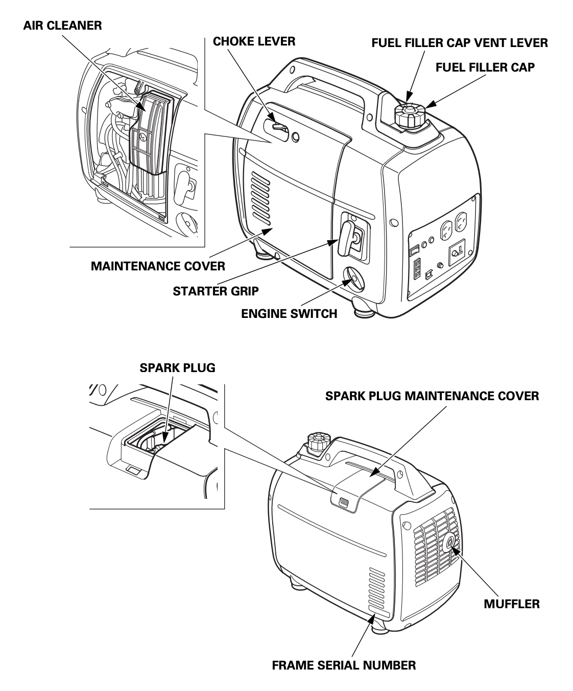

{.cover}

# Watt's The Problem?

## Start here

Generator given up the ghost? Ware-and-tear-wolves getting you down? Don't get spooked, we've got your back.

Let's start the the first things you should always check:

  1. [[#Check fuel]]
  2. [[#Check oil]]
  3. [[#Check spark plug]]
  4. [[#Check air filter]]
  5. [[#Check choke]]
  6. [[#Check engine is switched on]]

## Check fuel

## Check oil

## Check spark plug

## Check air filter

## Check choke

## Check engine is switched on
